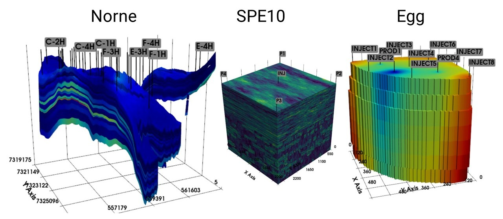

[](https://python.org)


# GeoCode

Python framework for reservoir engineering.



## Features

* reservoir representation with Grid, Rock, States, Wells, Faults, and PVT-tables
* interactive 3D visualization
* reservoir preprocessing tools
* detailed [documentation]()
* [tutorials](/tutorials) to explore the framework step-by-step

 > [!TIP]
 > Try out a new [web application]() based on DeepField for visualization and exploration of reservoir models.

## Installation

Clone the repository:

    git clone https://github.com/deepfield-team/GeoCode.git

Another option is to build the docker image with GeoCode inside.
Instructions and dockerfile are provided in the [docker](./docker) directory.

```
Note: the project is in developement. We welcome contributions and collaborations.
```

## Quick start

Load a reservoir model from `.DATA` file (some models are given in the [open_data](./open_data) directory):

```python

  from geocode import Field

  model = Field('model.data').load()
```

See the [tutorials](./tutorials) to explore the framework step-by-step
and the [documentation]() for more details.
