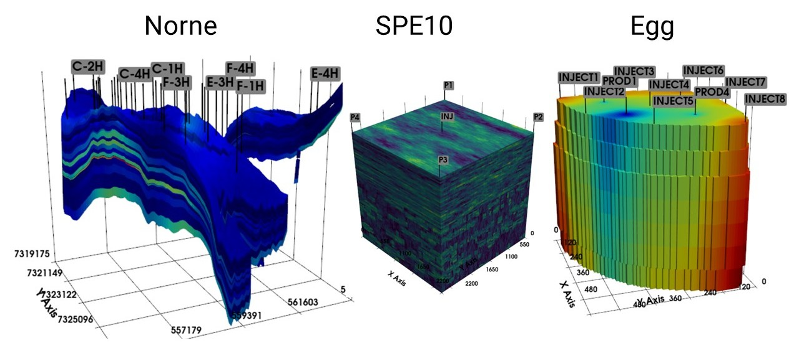

[](https://python.org)


# GeoCode

Python framework for reservoir engineering.



## Features

* reservoir representation with Grid, Rock, States, Wells, Faults, and PVT-tables
* interactive 3D visualization
* reservoir preprocessing tools
* detailed [documentation](https://geo-kit.github.io/GeoCode/)
* [notebooks](/notebooks) to explore the framework step-by-step

 > [!TIP]
 > Try out a new [web application](https://github.com/geo-kit/GeoView.git) based on GeoCode for visualization and exploration of reservoir models.

## Installation

Clone the repository:

    git clone https://github.com/geo-kit/GeoCode.git

To run reservoir simulations with [JutulDarcy](https://github.com/sintefmath/JutulDarcy.jl),
install [Julia](https://julialang.org/downloads/) and instantiate the driver dependencies once:

    julia --project=geocode/bin -e "using Pkg; Pkg.instantiate()"

> [!Note]
> Note: the project is in developement. We welcome contributions and collaborations.

## Quick start

Load a reservoir model from `.DATA` file (some models are given in the [open_data](./open_data) directory):

```python

  from geocode import Field

  model = Field('model.data').load()
```

See the [notebooks](./notebooks) to explore the framework step-by-step
and the [documentation](https://geo-kit.github.io/GeoCode/) for more details.
